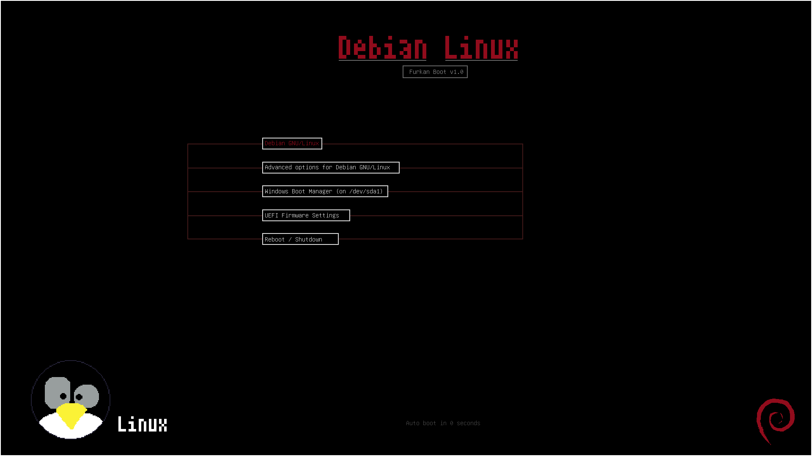

# My GRUB Theme

Debian kullanırken default GRUB temasından sıkıldım ve kendim nasıl yaparım diye araştırma yaptım.

Sade ve minimalist bir GRUB teması oluşturdum.

> background.png oluştururken Aseprite uygulamasını kullandım.




### Nasıl Kurulur?

grub temaları şu dizinde bulunur:
```bash
/boot/grub/themes/
```

kendi temamızı kopyalamalıyız. Ben kendi dizinim için yazıyorum, siz nereye indirdiyseniz ona göre değiştirin

```bash
sudo mkdir -p /boot/grub/themes/furkan-theme
sudo cp ~/Projects/grub-theme/my_grub_theme/* /boot/grub/themes/furkan-theme/
```

şimdi ise sisteme temayı tanıtmalıyız.
```bash
# vim yoksa nano yazın
# nano /etc/default/grub
sudo vim /etc/default/grub

```
aşağıdaki satır yoksa ekle.

```bash
GRUB_THEME="/boot/grub/themes/furkan-theme/theme.txt"
GRUB_FONT="/boot/grub/themes/furkan-theme/font.pf2"


```

sonra grubu güncelle:
```bash
sudo update-grub
```

Bütün bunları yaptıktan sonra `reboot` ile nihai sonucu görebilirsiniz.


Sisteminizde benimki gibi Dual-Boot yoksa büyük ihtimal windows yazılı kısım boş olacaktır. Belki de bambaşka bir durumda olacaktır. Belki sonrası için bunu çözerim. Belki de hiç bir şey yapmam çünkü bunu benden başka kimse kullanmayacağına eminim.